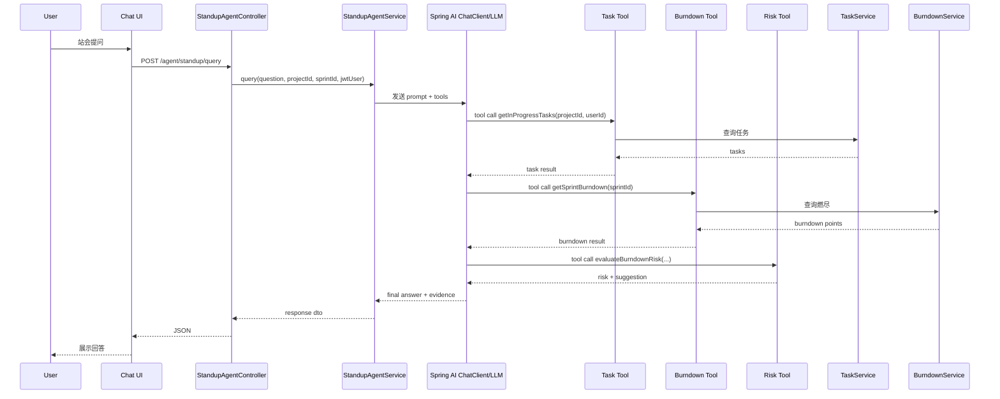

# 场景 A：Scrum 日常站会助手 技术设计文档（Spring AI + ReAct）

## 1. 文档目标

针对站会场景实现一个可落地的 Agent：

用户提问：
- “我今天有哪些 IN_PROGRESS 的任务？”
- “Sprint 3 目前燃尽是否偏离计划？”

目标行为：
1. Agent 识别为“任务查询 + 燃尽分析”复合意图
2. 通过 Spring AI Tool Calling 触发工具调用
3. 汇总工具结果并输出风险提示

> 本方案基于当前项目现状：Spring Boot + JWT + Task/Burndown 现有 API。

---

## 2. 架构设计

## 2.1 总体架构

1. Chat UI（前端聊天框）
2. `StandupAgentController`（统一入口）
3. Spring AI `ChatClient`（模型交互）
4. Tool 层（任务工具、燃尽工具、风险评估工具）
5. 现有业务服务层（TaskService / BurndownService）
6. PostgreSQL（业务数据 + Agent 审计数据）

关键原则：
- Agent 不直接写 SQL，优先调用现有 Service/API
- 业务逻辑仍在业务层，Agent 只做推理与编排

## 2.2 技术选型

- Spring Boot 3.2
- Spring AI（OpenAI-compatible 模型接入）
- Spring Security + JWT
- Spring Web + Validation
- Spring Data JPA
- Micrometer + Prometheus

## 2.3 ReAct 在 Spring AI 的实现方式

- **Reason**：由模型理解问题并决定下一步
- **Act**：模型自动选择并调用 `@Tool` 方法
- **Observe**：工具返回结构化结果，模型读取后继续推理
- **Respond**：模型输出最终回答（结论 + 依据 + 建议）

---

## 3. 模块设计（建议包结构）

`com.burndown.aiagent.standup`

- `controller/StandupAgentController.java`
  - `POST /api/v1/agent/standup/query`
- `service/StandupAgentService.java`
  - 组装 system prompt、调用 `ChatClient`
- `tool/StandupTaskTools.java`
  - `@Tool getInProgressTasks(...)`
- `tool/StandupBurndownTools.java`
  - `@Tool getSprintBurndown(...)`
- `tool/StandupRiskTools.java`
  - `@Tool evaluateBurndownRisk(...)`
- `prompt/StandupPromptTemplate.java`
  - 站会场景 system prompt 模板
- `dto/*`
  - 请求响应 DTO
- `entity/*`, `repository/*`
  - Agent 会话审计表

---

## 4. API 设计

## 4.1 Agent 统一入口

### `POST /api/v1/agent/standup/query`

请求：

```json
{
  "question": "我今天有哪些 IN_PROGRESS 的任务？另外 Sprint 3 目前燃尽是否偏离计划？",
  "projectId": 1,
  "sprintId": 3,
  "timezone": "Asia/Shanghai"
}
```

响应：

```json
{
  "code": "OK",
  "message": "success",
  "traceId": "a8f9c8b2d1",
  "data": {
    "answer": "你今天有 4 个进行中任务。Sprint 3 当前实际剩余工时高于计划 6.5h，属于中等延期风险。建议优先推进高优任务并减少并行。",
    "summary": {
      "inProgressCount": 4,
      "burndownDeviationHours": 6.5,
      "riskLevel": "MEDIUM"
    },
    "toolsUsed": ["getInProgressTasks", "getSprintBurndown", "evaluateBurndownRisk"],
    "evidence": [
      "IN_PROGRESS: PROJ-101, PROJ-108, PROJ-115, PROJ-121",
      "plannedRemaining=36.0h, actualRemaining=42.5h"
    ]
  }
}
```

鉴权：
- `Authorization: Bearer <jwt>`

---

## 5. Tool 设计（Spring AI）

## 5.1 任务工具

- 工具名：`getInProgressTasks`
- 入参：`projectId`、`userId`（从 JWT 注入，不信任前端）
- 数据来源：复用 `TaskService` / `TaskController` 对应能力
- 输出：任务 key、标题、优先级、更新时间

## 5.2 燃尽工具

- 工具名：`getSprintBurndown`
- 入参：`sprintId`
- 数据来源：`BurndownService.getBurndownData(sprintId)`
- 输出：最近点位、计划剩余、实际剩余、偏差

## 5.3 风险评估工具

- 工具名：`evaluateBurndownRisk`
- 入参：`plannedRemaining`、`actualRemaining`
- 输出：`LOW/MEDIUM/HIGH` + 建议文案

规则（MVP）：
- `ratio = (actualRemaining - plannedRemaining) / plannedRemaining`
- `ratio <= 0.05` -> LOW
- `0.05 < ratio <= 0.20` -> MEDIUM
- `ratio > 0.20` -> HIGH

---

## 6. ReAct 时序图（Spring AI Tool Calling）



---

## 7. 数据库设计

复用现有表：
- `tasks`
- `sprints`
- `burndown_points`（或对应表）

新增审计表：

## 7.1 `agent_chat_session`
- `id` BIGSERIAL PK
- `session_key` VARCHAR(64) UNIQUE NOT NULL
- `user_id` BIGINT NOT NULL
- `project_id` BIGINT NULL
- `created_at` TIMESTAMP NOT NULL DEFAULT NOW()
- `updated_at` TIMESTAMP NOT NULL DEFAULT NOW()

## 7.2 `agent_chat_message`
- `id` BIGSERIAL PK
- `session_id` BIGINT NOT NULL
- `role` VARCHAR(20) NOT NULL
- `question` TEXT
- `answer` TEXT
- `intent` VARCHAR(50)
- `tools_used` JSONB
- `risk_level` VARCHAR(20)
- `trace_id` VARCHAR(64)
- `latency_ms` INT
- `created_at` TIMESTAMP NOT NULL DEFAULT NOW()

## 7.3 `agent_tool_call_log`（推荐）
- `id` BIGSERIAL PK
- `message_id` BIGINT NOT NULL
- `tool_name` VARCHAR(64) NOT NULL
- `input_payload` JSONB
- `output_payload` JSONB
- `status` VARCHAR(20) NOT NULL
- `error_code` VARCHAR(50)
- `duration_ms` INT
- `created_at` TIMESTAMP NOT NULL DEFAULT NOW()

---

## 8. 配置项设计

建议在 `application.yml` 增加：

- `agent.standup.enabled=true`
- `agent.standup.max-tool-rounds=3`
- `agent.standup.response-timeout=30s`
- `agent.standup.require-evidence=true`

Spring AI 模型配置（示例前缀，按实际 starter 调整）：
- `spring.ai.openai.base-url=...`
- `spring.ai.openai.api-key=...`
- `spring.ai.openai.chat.options.model=...`
- `spring.ai.openai.chat.options.temperature=0.2`

---

## 9. 安全与治理

1. JWT 鉴权：所有 Agent 请求必须登录
2. 权限控制：工具层按 `userId + projectId` 校验访问范围
3. 工具白名单：仅允许注册的内部工具被调用
4. 提示词约束：禁止输出未调用工具得出的“硬结论”
5. 审计追踪：记录 `traceId` + 工具调用链

---

## 10. 监控指标

- `standup_agent_requests_total`
- `standup_agent_duration_ms`
- `standup_agent_tool_calls_total{tool_name}`
- `standup_agent_tool_failures_total{tool_name}`
- `standup_agent_fallback_total`

告警建议：
- 5 分钟错误率 > 5%
- P95 > 8s

---

## 11. 实施计划（Spring AI 版，4~6 天）

Day 1：
- 引入 Spring AI 依赖与基础配置
- 建立 `StandupAgentController/Service`

Day 2：
- 实现 `getInProgressTasks`、`getSprintBurndown` 两个 Tool
- 跑通单轮 Tool Calling

Day 3：
- 增加 `evaluateBurndownRisk` Tool
- 固化“结论 + 证据 + 建议”输出模板

Day 4：
- 增加会话与工具日志落库
- 接入 Micrometer 指标

Day 5~6：
- 权限校验、异常兜底、回归测试
- 验收演示

---

## 12. 验收标准

1. 对组合问题可自动触发多工具调用
2. 回答中包含证据来源（任务 key、燃尽数值）
3. 风险等级判定与规则一致
4. 权限不足时拒绝访问且不泄露数据
5. 可查询会话与工具调用日志

---

（本文档为“场景 A”的 Spring AI ReAct 技术实现版本，可直接用于开发评审。）
