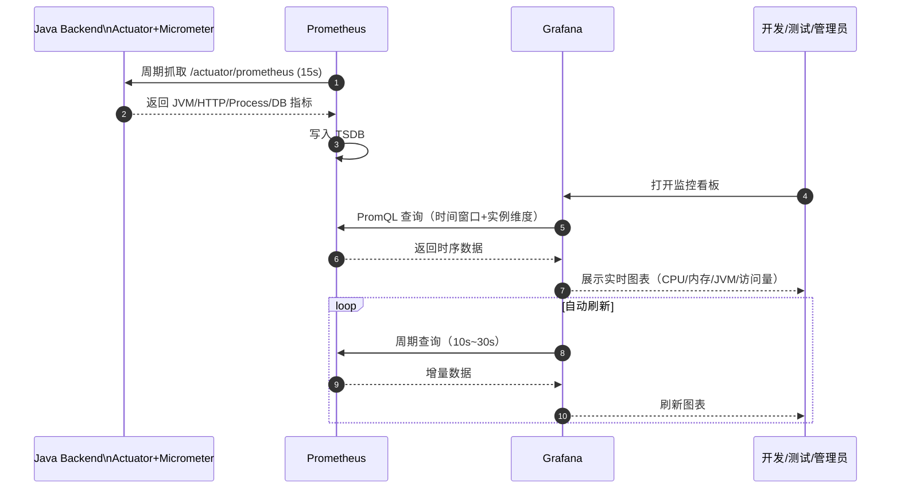
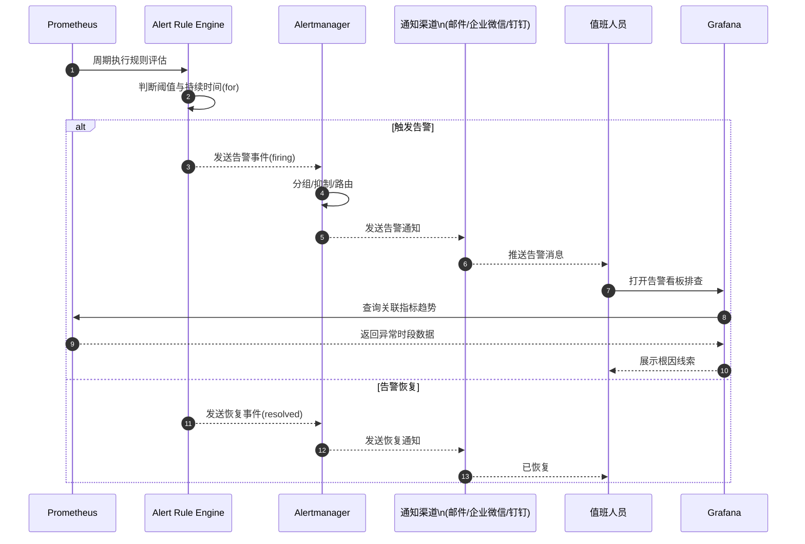
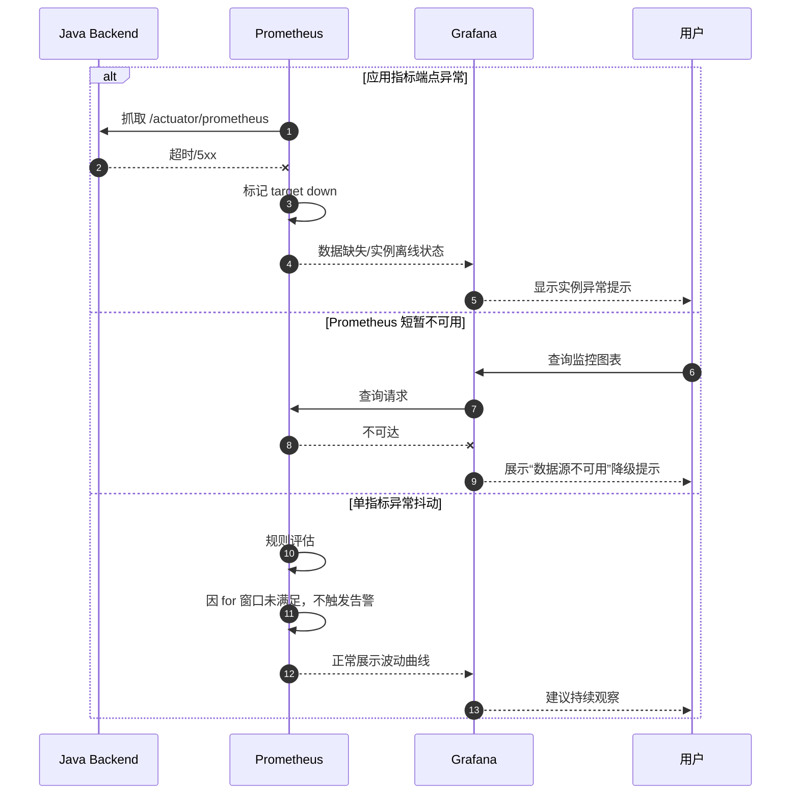

# 后端监控系统序列图设计

本文给出监控方案核心时序：
1. 指标采集与可视化流程
2. 告警触发与通知流程
3. 异常与降级处理流程

---

## 1. 指标采集与可视化时序图

---

## 2. 告警触发与通知时序图

---

## 3. 异常与降级处理时序图

---

## 4. 时序设计说明

1. **拉模型采集**：Prometheus 主动抓取，避免应用侧推送复杂度。
2. **规则先评估后通知**：告警由规则引擎统一判定，减少误报。
3. **告警降噪机制**：依赖 `for`、分组、抑制、静默，避免通知风暴。
4. **可视化与排障闭环**：告警触发后可快速进入 Grafana 下钻定位。
5. **降级可见性**：采集失败、数据源不可用均需在看板可见，避免“静默故障”。
