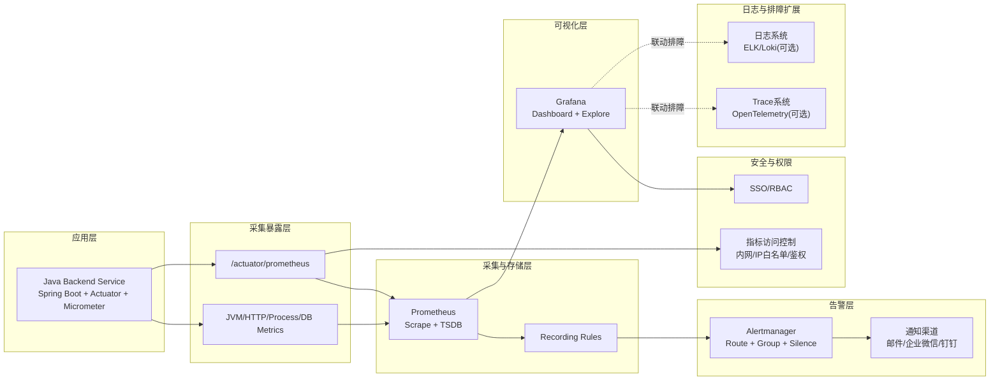

# 后端监控系统架构设计文档

## 1. 文档信息

- 文档名称：后端监控系统架构设计文档
- 目标目录：`D:\java\claude\projects\1\新需求\monitoring`
- 设计范围：Java 后端运行监控（CPU、内存、JVM、访问量、错误率、性能）
- 版本：v1.1

---

## 2. 设计目标

围绕当前 Java 后端服务，建设一套“实时可观测、可告警、可追溯、可扩展”的监控平台，实现：

1. 实时采集并展示系统与应用关键指标
2. 对异常指标自动告警并支持恢复通知
3. 支持按服务、实例、时间窗口定位性能问题
4. 保持低侵入接入，不影响主业务流程
5. 为后续调试、压测、容量规划提供数据基础

---

## 3. 总体架构设计

---

## 4. 分层职责设计

### 4.1 应用埋点层（Java 服务）

职责：
- 暴露标准监控端点 `/actuator/prometheus`
- 自动采集 JVM、进程、HTTP、连接池等指标
- 支持自定义业务指标（如关键接口耗时、任务处理量）

关键组件：
- `spring-boot-starter-actuator`
- `micrometer-registry-prometheus`

### 4.2 指标采集与存储层（Prometheus）

职责：
- 定时拉取应用指标（默认 15s）
- 存储时序数据（TSDB）
- 提供 PromQL 查询能力
- 通过 Recording Rules 预聚合高频查询指标

### 4.3 可视化层（Grafana）

职责：
- 提供总览、JVM、接口性能等仪表盘
- 支持时间范围、实例、接口维度筛选
- 支持图表导出与历史趋势分析

### 4.4 告警层（Alertmanager）

职责：
- 管理阈值告警规则（CPU、内存、GC、错误率、延迟）
- 告警分组、抑制、静默与恢复通知
- 通知多渠道分发（邮件、企业IM）

### 4.5 安全与权限层

职责：
- 监控平台登录鉴权
- 看板访问 RBAC 控制（管理员/开发/测试）
- 指标端点访问控制（网络隔离、白名单）

### 4.6 可观测性扩展层（可选）

职责：
- 指标异常联动日志与 Trace，提高定位效率
- 支持 traceId 贯通“指标 -> 请求 -> 日志”

---

## 5. 指标体系设计

### 5.1 主机与进程指标
- CPU 使用率（系统、进程）
- 内存使用率（系统、RSS）
- 磁盘与网络（可选）

### 5.2 JVM 指标
- `jvm_memory_used_bytes` / `jvm_memory_max_bytes`
- `jvm_gc_pause_seconds_*`
- `jvm_threads_live_threads`
- `jvm_classes_loaded_classes`

### 5.3 HTTP 与接口性能指标
- `http_server_requests_seconds_count`
- `http_server_requests_seconds_sum`
- `http_server_requests_seconds_bucket`（分位统计）
- 按 URI、method、status 维度分析流量与错误

### 5.4 数据库与连接池指标
- HikariCP 活跃连接、空闲连接、等待连接
- 数据库请求耗时（若开启 SQL 指标采集）

---

## 6. 告警架构设计

## 6.1 告警分级
- P1（严重）：CPU/内存持续高位、错误率激增、Full GC 频繁
- P2（重要）：P95 响应变慢、QPS 异常突增
- P3（提示）：磁盘空间临界、单实例轻微波动

## 6.2 告警规则示例

1. CPU 过高：`CPU > 80%` 持续 5 分钟
2. 内存过高：`Memory > 85%` 持续 5 分钟
3. 错误率升高：`5xx / total > 5%` 持续 3 分钟
4. 响应变慢：`P95 > 2s` 持续 5 分钟
5. Full GC 频繁：10 分钟内次数超过阈值

## 6.3 告警降噪策略
- 连续触发再告警（for 窗口）
- 同类告警聚合（group_by）
- 夜间静默策略（silence）
- 告警恢复通知（resolved）

---

## 7. 关键流程设计

### 7.1 指标采集流程

1. 应用暴露 `/actuator/prometheus`
2. Prometheus 定时抓取并写入 TSDB
3. Grafana 查询并展示实时图表

### 7.2 告警触发流程

1. Prometheus 按规则计算阈值
2. 触发告警并发送至 Alertmanager
3. Alertmanager 路由到目标渠道
4. 用户收到通知并进入看板排查

### 7.3 调试排障流程

1. 在总览看板发现异常
2. 下钻到 JVM/接口维度定位瓶颈
3. 联动日志/Trace 确认根因
4. 调整参数后观察指标恢复

---

## 8. 数据与配置设计

### 8.1 关键配置项
- Prometheus 抓取间隔：`scrape_interval=15s`
- 指标保留时长：建议 15~30 天（按磁盘容量）
- Grafana 刷新间隔：10s/30s/1m 可配置

### 8.2 环境隔离
- dev/test/prod 分环境数据源
- 仪表盘按环境切换变量

### 8.3 命名规范
- 自定义指标统一前缀：`burndown_*` 或 `app_*`
- 标签规范：避免高基数标签（如 userId、traceId）直接入指标

---

## 9. 非功能设计

### 9.1 性能
- 监控接入后应用性能损耗目标 < 5%
- 看板查询 P95 < 2s

### 9.2 可用性
- 监控平台可用性目标 99.9%
- 采集失败自动重试，短时故障可恢复

### 9.3 安全
- 指标端点限制内网访问
- 看板访问启用登录与权限控制
- 敏感配置脱敏展示

### 9.4 可扩展性
- 支持多实例扩容与自动发现
- 支持新增业务指标与告警模板

---

## 10. 分阶段落地方案

### P0（1~2 周）
- 接入 Actuator + Micrometer
- 部署 Prometheus + Grafana + Alertmanager
- 完成总览看板与核心告警（CPU/内存/错误率/P95）

### P1（2~4 周）
- 增加 JVM 深度看板与慢接口分析
- 完成告警分级、恢复通知、降噪策略
- 增加历史趋势分析与报表导出

### P2（4~6 周）
- 日志与 Trace 联动排障
- 建立业务指标体系（如关键流程成功率）
- 推进多环境统一监控视图

---

## 11. 验收标准

1. 可实时查看 CPU、内存、JVM、访问量、错误率、延迟指标
2. 告警规则可按阈值触发并推送通知
3. 可按服务实例/接口维度下钻分析
4. 支持近 7 天历史趋势查看
5. 监控接入后主业务稳定，无明显性能回退

---

## 12. 与现有系统对接点

后端配置建议：
- `backend/pom.xml` 增加 Actuator 与 Micrometer 依赖
- `backend/src/main/resources/application.yml` 开放必要 management 端点
- 新增业务自定义指标采集（可放入 `service/metrics/*`）

平台侧建议：
- 新增 `monitoring/prometheus.yml`
- 新增 `monitoring/alert_rules.yml`
- 新增 Grafana Dashboard JSON（总览/JVM/接口）

该方案与现有 Java 后端低侵入集成，可快速形成“监控 + 告警 + 排障”闭环。