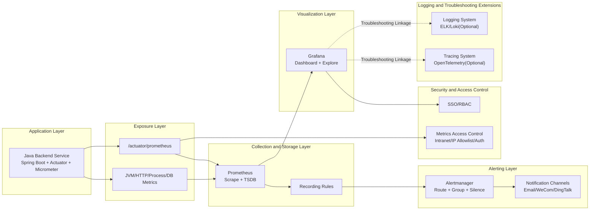

# Backend Monitoring System Architecture Design

## 1. Document Information

- Document Name: Backend Monitoring System Architecture Design
- Target Directory: `D:\java\claude\projects\1\新需求\monitoring`
- Scope: Java backend runtime monitoring (CPU, memory, JVM, traffic, error rate, performance)
- Version: v1.1

---

## 2. Design Goals

Build a monitoring platform for the current Java backend that is **real-time observable, alertable, traceable, and scalable**:

1. Real-time collection and visualization of key system/application metrics
2. Automatic alerting on abnormal indicators with recovery notifications
3. Service/instance/time-window based performance troubleshooting
4. Low-intrusion integration without impacting core business flows
5. Data support for debugging, stress testing, and capacity planning

---

## 3. Overall Architecture Design

---

## 4. Layered Responsibilities

### 4.1 Application Instrumentation Layer (Java Service)

Responsibilities:
- Expose standard monitoring endpoint `/actuator/prometheus`
- Auto-collect JVM/process/HTTP/connection-pool metrics
- Support custom business metrics (e.g., key API latency, task processing volume)

Key components:
- `spring-boot-starter-actuator`
- `micrometer-registry-prometheus`

### 4.2 Collection and Storage Layer (Prometheus)

Responsibilities:
- Pull metrics periodically (default: 15s)
- Store time-series data in TSDB
- Provide PromQL query capability
- Pre-aggregate high-frequency queries via Recording Rules

### 4.3 Visualization Layer (Grafana)

Responsibilities:
- Provide overview/JVM/API-performance dashboards
- Support filtering by time window/instance/API
- Support chart export and historical trend analysis

### 4.4 Alerting Layer (Alertmanager)

Responsibilities:
- Manage threshold alert rules (CPU, memory, GC, error rate, latency)
- Alert grouping, inhibition, silence, and recovery notification
- Multi-channel notification delivery (email/enterprise IM)

### 4.5 Security and Access Layer

Responsibilities:
- Monitoring platform authentication
- RBAC-based dashboard access control (admin/dev/test)
- Metrics endpoint access control (network isolation/allowlist)

### 4.6 Observability Extension Layer (Optional)

Responsibilities:
- Correlate metric anomalies with logs and traces for faster root cause analysis
- Support traceId flow: metrics -> request -> logs

---

## 5. Metrics System Design

### 5.1 Host and Process Metrics
- CPU usage (system/process)
- Memory usage (system/RSS)
- Disk and network (optional)

### 5.2 JVM Metrics
- `jvm_memory_used_bytes` / `jvm_memory_max_bytes`
- `jvm_gc_pause_seconds_*`
- `jvm_threads_live_threads`
- `jvm_classes_loaded_classes`

### 5.3 HTTP and API Performance Metrics
- `http_server_requests_seconds_count`
- `http_server_requests_seconds_sum`
- `http_server_requests_seconds_bucket` (percentile stats)
- Analyze traffic and errors by URI/method/status dimensions

### 5.4 Database and Connection Pool Metrics
- HikariCP active/idle/pending connections
- DB request latency (if SQL metrics are enabled)

---

## 6. Alerting Architecture Design

## 6.1 Alert Severity Levels
- P1 (Critical): sustained high CPU/memory, error-rate spike, frequent Full GC
- P2 (Major): slow P95 response, abnormal QPS surge
- P3 (Minor): near-threshold disk usage, mild single-instance fluctuation

## 6.2 Alert Rule Examples

1. High CPU: `CPU > 80%` for 5 minutes
2. High Memory: `Memory > 85%` for 5 minutes
3. Rising Error Rate: `5xx / total > 5%` for 3 minutes
4. Slow Response: `P95 > 2s` for 5 minutes
5. Frequent Full GC: count exceeds threshold within 10 minutes

## 6.3 Alert Noise Reduction Strategy
- Trigger only after sustained violation (`for` window)
- Group similar alerts (`group_by`)
- Night-time silence policies (`silence`)
- Recovery notifications (`resolved`)

---

## 7. Key Process Design

### 7.1 Metrics Collection Process

1. Application exposes `/actuator/prometheus`
2. Prometheus scrapes periodically and writes to TSDB
3. Grafana queries and renders real-time charts

### 7.2 Alert Trigger Process

1. Prometheus evaluates thresholds by alert rules
2. Alerts are sent to Alertmanager
3. Alertmanager routes to target channels
4. Users receive notifications and investigate via dashboards

### 7.3 Debugging and Troubleshooting Process

1. Detect anomalies on overview dashboard
2. Drill down into JVM/API dimensions
3. Correlate with logs/traces to confirm root cause
4. Adjust parameters and observe recovery

---

## 8. Data and Configuration Design

### 8.1 Key Configurations
- Prometheus scrape interval: `scrape_interval=15s`
- Metric retention period: recommended 15~30 days (based on disk capacity)
- Grafana refresh interval: configurable at 10s/30s/1m

### 8.2 Environment Isolation
- Separate data sources for dev/test/prod
- Dashboard variables for environment switching

### 8.3 Naming Conventions
- Custom metrics prefix: `burndown_*` or `app_*`
- Label standard: avoid high-cardinality labels (e.g., userId/traceId) in metrics

---

## 9. Non-functional Design

### 9.1 Performance
- Monitoring overhead target on application: < 5%
- Dashboard query latency P95: < 2s

### 9.2 Availability
- Monitoring platform availability target: 99.9%
- Automatic retry for collection failures; quick recovery from transient faults

### 9.3 Security
- Restrict metrics endpoints to intranet access
- Dashboard access requires authentication and authorization
- Mask sensitive configuration data

### 9.4 Scalability
- Support multi-instance expansion and auto-discovery
- Support new business metrics and alert templates

---

## 10. Phased Implementation Plan

### P0 (1~2 weeks)
- Integrate Actuator + Micrometer
- Deploy Prometheus + Grafana + Alertmanager
- Deliver overview dashboard and core alerts (CPU/memory/error rate/P95)

### P1 (2~4 weeks)
- Add deep JVM dashboards and slow-endpoint analysis
- Implement alert grading/recovery/noise reduction
- Add historical trend analysis and report export

### P2 (4~6 weeks)
- Enable log-trace linked troubleshooting
- Build business metric system (e.g., key workflow success rate)
- Establish unified multi-environment monitoring view

---

## 11. Acceptance Criteria

1. Real-time visibility of CPU/memory/JVM/traffic/error-rate/latency metrics
2. Alert rules trigger correctly and notifications are delivered
3. Drill-down analysis by service instance/API is supported
4. Historical trends for the last 7 days are available
5. Monitoring integration causes no significant performance regression in core business flows

---

## 12. Integration Points with Existing System

Backend configuration recommendations:
- Add Actuator and Micrometer dependencies in `backend/pom.xml`
- Expose required management endpoints in `backend/src/main/resources/application.yml`
- Add custom business metric collection (e.g., under `service/metrics/*`)

Platform-side recommendations:
- Add `monitoring/prometheus.yml`
- Add `monitoring/alert_rules.yml`
- Add Grafana dashboard JSON files (overview/JVM/API)

This architecture can be integrated into the existing Java backend with low intrusion and quickly establish a closed loop of **monitoring + alerting + troubleshooting**.
