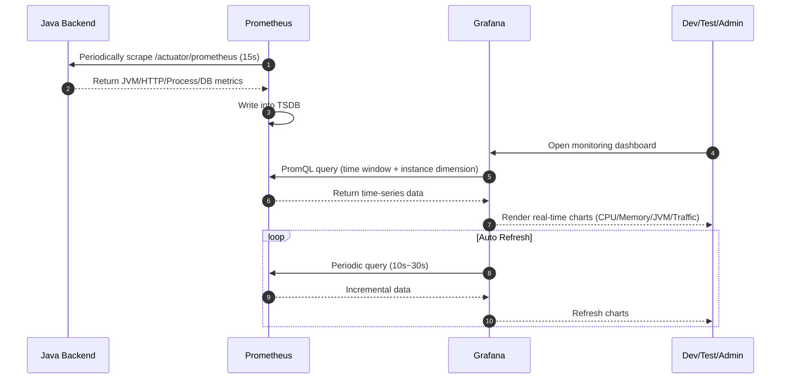
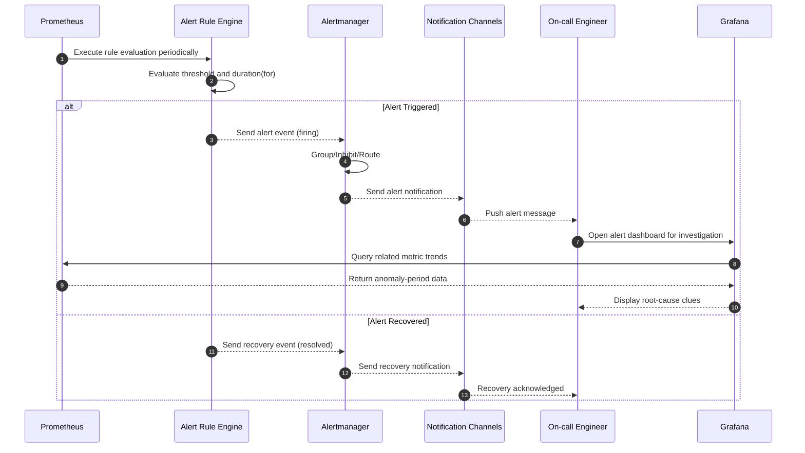
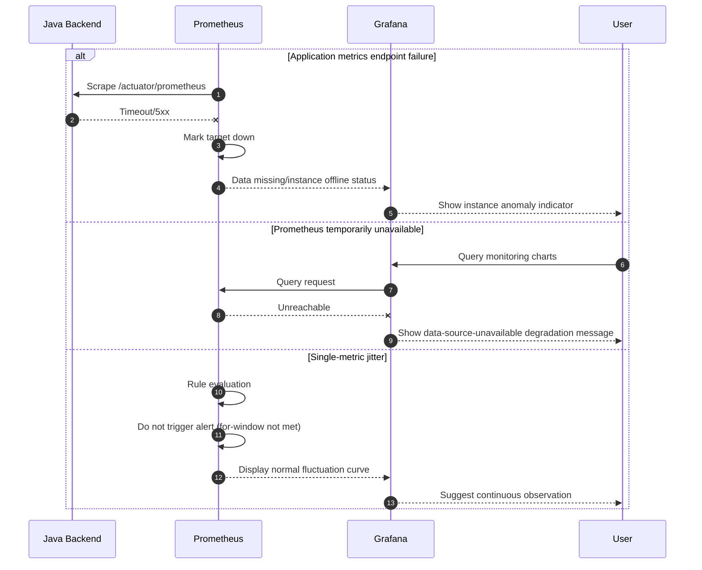

# Backend Monitoring System Sequence Diagram Design

This document provides the core sequence flows for the monitoring solution:
1. Metrics collection and visualization flow
2. Alert triggering and notification flow
3. Exception and degradation handling flow

---

## 1. Metrics Collection and Visualization Sequence Diagram

---

## 2. Alert Triggering and Notification Sequence Diagram

---

## 3. Exception and Degradation Handling Sequence Diagram

---

## 4. Sequence Design Notes

1. **Pull-based collection model**: Prometheus actively scrapes metrics, reducing application-side push complexity.
2. **Rule-evaluate-before-notify**: Alert decisions are centralized in rule evaluation, reducing false positives.
3. **Alert noise reduction**: Use `for`, grouping, inhibition, and silence to prevent notification storms.
4. **Visualization-troubleshooting closed loop**: After alerts, users can quickly drill down in Grafana.
5. **Degradation visibility**: Collection failures and data-source outages must be visible on dashboards to avoid silent failures.
